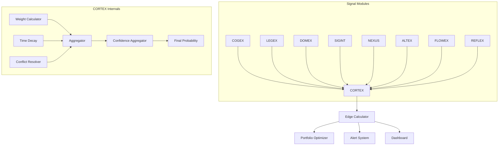
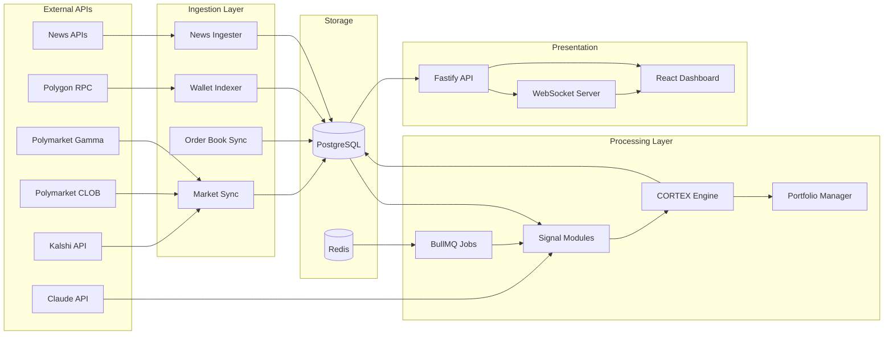
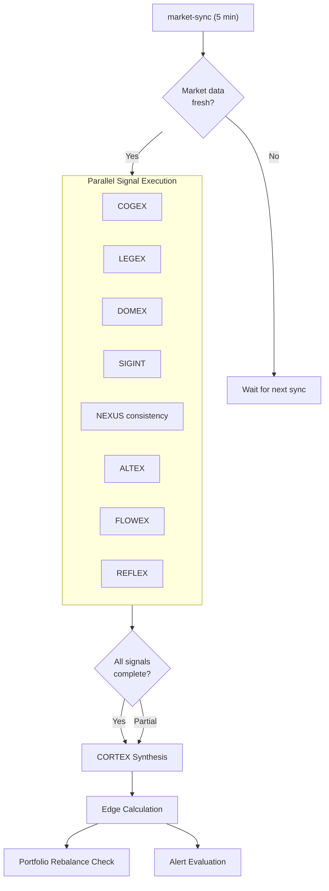

# APEX — Product Requirements Document

**Version:** 1.0
**Author:** PUL LLC
**Date:** 2026-03-24
**Status:** Draft
**Classification:** Internal — PUL LLC Confidential

---

## Table of Contents

1. [Vision & Strategic Context](#1-vision--strategic-context)
2. [Core Features — Signal Modules](#2-core-features--signal-modules)
3. [CORTEX Synthesis Engine](#3-cortex-synthesis-engine)
4. [Portfolio Management](#4-portfolio-management)
5. [Data Architecture & Models](#5-data-architecture--models)
6. [API Surface](#6-api-surface)
7. [Background Jobs & Scheduling](#7-background-jobs--scheduling)
8. [Alert System](#8-alert-system)
9. [Backtesting & Performance Tracking](#9-backtesting--performance-tracking)
10. [UI/UX Requirements](#10-uiux-requirements)
11. [Non-Functional Requirements](#11-non-functional-requirements)
12. [Success Metrics](#12-success-metrics)
13. [Risks & Mitigations](#13-risks--mitigations)
14. [Phased Delivery Plan](#14-phased-delivery-plan)

---

## 1. Vision & Strategic Context

### 1.1 What APEX Is

APEX (Automated Prediction-market Edge eXploitation) is an agentic intelligence platform that systematically identifies mispriced contracts on Kalshi and Polymarket. It combines eight independent AI-driven signal modules, a Bayesian synthesis engine (CORTEX), and a portfolio optimizer to surface actionable trading edges with calibrated confidence and Kelly-optimal sizing.

### 1.2 The Thesis

Prediction markets are structurally inefficient. Unlike equity markets with decades of institutional infrastructure, prediction markets suffer from:

- **Cognitive biases**: Retail-dominated participant pools exhibit anchoring, recency bias, favorite-longshot bias, and systematic tail-risk underpricing.
- **Information asymmetry**: Fragmented information sources (especially non-English language sources, on-chain data, and domain expertise) create pockets where informed participants can extract edge.
- **Microstructure effects**: Thin order books, liquidity-driven price moves unrelated to fundamentals, and reflexive feedback loops between prices and outcomes create temporary mispricings.
- **Resolution ambiguity**: Complex or ambiguous resolution criteria lead to mispricing when traders interpret resolution differently from the platform's actual rules.

APEX exploits each of these inefficiency classes through dedicated signal modules, then synthesizes them into a unified probability estimate that can be compared to market prices to identify edges.

### 1.3 Target User

| Attribute | Value |
|---|---|
| User | LJ, Founder of PUL LLC |
| Role | Solo operator, quantitative trader |
| Workflow | Monitor dashboard daily, review alerts, execute trades manually on Kalshi/Polymarket |
| Technical level | Can operate terminal, read logs, adjust configuration |
| Goal | Sustained positive returns via systematic edge detection on prediction markets |

APEX is a single-user system. There is no multi-tenancy, team management, or public-facing API. Authentication exists solely to prevent unauthorized local network access.

---

## 2. Core Features — Signal Modules

All 8 modules conform to a unified output interface:

```typescript
interface SignalOutput {
  moduleId: string;             // e.g., "COGEX", "LEGEX"
  marketId: string;             // unified internal market ID
  probability: number;          // 0.0 - 1.0
  confidence: number;           // 0.0 - 1.0
  reasoning: string;            // human-readable explanation
  metadata: Record<string, unknown>; // module-specific data
  timestamp: Date;
  expiresAt: Date;              // signal staleness boundary
}
```

### 2.1 COGEX — Cognitive Exploitation

| Field | Detail |
|---|---|
| **Purpose** | Detect and quantify systematic cognitive biases in market pricing |
| **Inputs** | Current market price, price history, initial listing price, resolution date, market category, historical outcomes for similar markets |
| **Outputs** | Bias-adjusted probability + confidence; metadata includes per-bias magnitude scores |
| **Methodology** | Four statistical bias detectors run independently, each producing an adjustment factor |
| **Data Sources** | Internal Postgres (market prices, historical outcomes) — no external API calls |
| **Update Frequency** | Every 15 minutes (on signal pipeline tick) |
| **Dependencies** | Market sync must have completed; requires >= 30 days of historical outcome data for calibration |
| **Edge Cases** | New market categories with no historical data — COGEX outputs low confidence (< 0.2) rather than guessing |

**Bias Detection Methodology:**

1. **Anchoring Bias**: Measures price clustering around round numbers (0.10, 0.25, 0.50, 0.75, 0.90) and distance from initial listing price. Computes a "stickiness score" — ratio of time spent within 2% of an anchor vs. expected under random walk. Adjusts probability away from anchors proportional to stickiness.

2. **Tail Risk Underpricing**: Compares implied probability of extreme outcomes (< 0.10 or > 0.90) against base rates from historical resolved markets in the same category. Uses a power-law tail distribution fit to historical outcomes. If market implies thinner tails than history shows, adjusts probability toward fatter tails.

3. **Recency Bias**: Detects overweighting of recent events by comparing market price sensitivity to time-windowed news (7-day vs. 90-day). If short-window sensitivity is >2x long-window sensitivity, flags recency bias. Adjustment dampens the recency-driven component.

4. **Favorite-Longshot Bias**: Bins historical markets by implied probability at time T-before-resolution, computes actual outcome rates per bin. If favorites (>0.70) resolve YES less often than implied and longshots (<0.30) resolve YES more often, applies calibration adjustment.

The four adjustments are combined via weighted average (weights tuned via backtest) into a single bias-adjusted probability.

---

### 2.2 LEGEX — Legal/Resolution Exploitation

| Field | Detail |
|---|---|
| **Purpose** | Identify mispricing caused by ambiguous or misunderstood resolution criteria |
| **Inputs** | Market resolution text, market title, market description, resolution source URL, comparable markets on other platforms |
| **Outputs** | Probability adjustment based on resolution interpretation risk; confidence reflects clarity of resolution language |
| **Methodology** | LLM-based structured analysis of resolution text |
| **Data Sources** | Kalshi API (resolution rules), Polymarket API (resolution text), Claude API |
| **Update Frequency** | On market creation + every 24 hours (resolution text rarely changes) |
| **Dependencies** | Market sync; Claude API availability |
| **Edge Cases** | Markets with external resolution oracles (UMA on Polymarket) — LEGEX flags oracle-based resolution as additional risk factor |

**LLM Analysis Pipeline:**

1. **Resolution Parsing**: Claude extracts structured fields: resolution source, resolution date/trigger, YES condition, NO condition, edge cases mentioned, edge cases NOT mentioned.

2. **Ambiguity Scoring**: Claude rates each resolution criterion on a 1-5 ambiguity scale, identifying specific phrases that could be interpreted multiple ways.

3. **Cross-Platform Comparison**: For markets that exist on both Kalshi and Polymarket, Claude compares resolution language and flags divergences. Price differences between platforms on "same" markets may reflect resolution differences, not probability differences.

4. **Misinterpretation Risk**: Claude estimates the probability that the median trader's interpretation of resolution differs from the platform's likely actual resolution. This delta is the LEGEX edge signal.

**Prompt Budget**: ~2,000 input tokens + ~500 output tokens per market analysis. Budget: $0.015 per market per analysis cycle.

---

### 2.3 DOMEX — Domain Expert Exploitation

| Field | Detail |
|---|---|
| **Purpose** | Generate informed probability estimates via specialized domain expert agents |
| **Inputs** | Market title, description, resolution criteria, current price, relevant context (fetched per domain) |
| **Outputs** | Aggregated expert probability + confidence; metadata includes per-expert breakdown |
| **Methodology** | Expert swarm — multiple Claude agents with domain-specific system prompts produce independent estimates, then aggregated via trimmed mean |
| **Data Sources** | Claude API, curated context per domain (Fed statements, FOMC calendars, geopolitical briefings, crypto protocol data) |
| **Update Frequency** | Every 15 minutes for active markets; every 6 hours for markets > 30 days from resolution |
| **Dependencies** | Market sync; Claude API; domain context data freshness |
| **Edge Cases** | Markets spanning multiple domains — routed to all relevant experts; markets in uncovered domains get no DOMEX signal |

**Expert Agents (Initial):**

| Agent | Domain | Context Sources |
|---|---|---|
| FED-HAWK | Federal Reserve / monetary policy | FOMC statements, dot plots, Fed speeches, Treasury yields, inflation data (FRED API) |
| GEO-INTEL | Geopolitics / international relations | State Dept briefings, OSINT feeds, conflict trackers |
| CRYPTO-ALPHA | Crypto / DeFi | Protocol governance, on-chain metrics, developer activity, regulatory filings |

Each agent receives a domain-specific system prompt (stored in `packages/domex/prompts/{agent}.md`) that includes:
- Domain expertise persona and reasoning framework
- Calibration instructions (base rate awareness, reference class forecasting)
- Output format: probability, confidence, top 3 factors, key uncertainties

**Aggregation**: Trimmed mean (drop highest and lowest if >= 3 experts) of agent probabilities. Confidence is the minimum of (a) average agent confidence and (b) inverse of agent disagreement (standard deviation).

**Prompt Budget**: ~3,000 input tokens + ~800 output tokens per expert per market. With 3 experts: $0.07 per market per cycle.

---

### 2.4 SIGINT — Signal Intelligence

| Field | Detail |
|---|---|
| **Purpose** | Track on-chain wallet behavior on Polymarket to identify smart money positioning |
| **Inputs** | Polygon blockchain data (ERC-1155 transfers for Polymarket conditional tokens), wallet history, market prices |
| **Outputs** | Smart money divergence signal — probability shift based on where classified smart wallets are positioning |
| **Methodology** | Wallet classification + position tracking + divergence detection |
| **Data Sources** | Polygon RPC (Alchemy/QuickNode), Polymarket subgraph (TheGraph), internal wallet profile DB |
| **Update Frequency** | Wallet profiling: every 1 hour; position monitoring: every 5 minutes |
| **Dependencies** | Market sync (Polymarket); Polygon RPC availability |
| **Edge Cases** | Wallet rotation (smart money using fresh wallets) — detection via transfer pattern clustering; only applies to Polymarket (Kalshi is centralized, no on-chain data) |

**Wallet Classification Algorithm:**

1. **Data Collection**: Index all Polymarket conditional token transfers from Polygon. Track wallet-level P&L by matching buys to resolutions.

2. **Classification Features**: Historical ROI, win rate, average position size, timing (early/late mover), market category concentration, transaction frequency.

3. **Classification Labels**:
   - `SMART_MONEY`: ROI > 15% over 100+ resolved markets, consistent edge across categories
   - `MARKET_MAKER`: High transaction frequency, positions on both sides, tight spread behavior
   - `WHALE`: Position sizes > $50k but no demonstrated consistent edge
   - `RETAIL`: Default classification
   - `BOT`: Transaction timing patterns indicative of automated trading (sub-second response to price changes)

4. **Divergence Signal**: When aggregate SMART_MONEY positioning diverges from market price by > 5%, SIGINT generates a probability signal in the direction of smart money. Signal strength scales with (a) number of smart wallets aligned, (b) magnitude of their positions, (c) recency of their trades.

---

### 2.5 NEXUS — Network/Causal Exploitation

| Field | Detail |
|---|---|
| **Purpose** | Map causal relationships between markets and detect inconsistent implied joint probabilities |
| **Inputs** | All active markets, their current prices, historical price correlations, LLM-identified causal links |
| **Outputs** | Per-market probability adjustment based on cross-market consistency; inconsistency flags |
| **Methodology** | Causal graph construction + joint probability consistency checking |
| **Data Sources** | Internal market data, Claude API (for causal link identification), historical price correlation matrix |
| **Update Frequency** | Graph rebuild: every 6 hours; consistency check: every 15 minutes |
| **Dependencies** | Market sync; Claude API; sufficient market universe (> 50 active markets) |
| **Edge Cases** | Circular causality — detected and flagged but not adjusted; markets with no identified causal links get no NEXUS signal |

**Methodology:**

1. **Graph Construction** (every 6 hours):
   - LLM pass: Claude identifies causal relationships between markets from titles/descriptions. Output: directed edges with relationship type (`CAUSES`, `PREVENTS`, `CORRELATES`, `CONDITIONAL_ON`) and estimated effect magnitude.
   - Statistical pass: compute rolling 30-day price correlation matrix. Edges with |correlation| > 0.3 and no LLM-identified link are flagged for review.
   - Merge: LLM edges + statistical edges form the causal graph, stored in Postgres.

2. **Consistency Checking** (every 15 minutes):
   - For each connected subgraph, extract implied joint probability distribution from individual market prices.
   - Check for violations: P(A AND B) <= min(P(A), P(B)); P(A OR B) >= max(P(A), P(B)); conditional probability consistency.
   - If market X implies P(A) = 0.70 but the causal graph and related markets imply P(A) should be 0.55, NEXUS produces a signal adjusting toward 0.55.

---

### 2.6 ALTEX — Alternative Data Exploitation

| Field | Detail |
|---|---|
| **Purpose** | Detect information asymmetry via news analysis and non-English language intelligence |
| **Inputs** | News feeds, Chinese-language sources, market titles/descriptions for relevance matching |
| **Outputs** | Probability shift based on detected information not yet priced in; confidence based on source reliability and relevance |
| **Methodology** | News ingestion → relevance filtering → sentiment/impact analysis → probability adjustment |
| **Data Sources** | NewsAPI (English), Xinhua/SCMP/Caixin RSS (Chinese), Claude API for analysis |
| **Update Frequency** | News ingestion: every 5 minutes; analysis: every 15 minutes |
| **Dependencies** | Market sync; news API availability; Claude API |
| **Edge Cases** | Fake news detection — Claude is instructed to assess source reliability; non-Chinese foreign language sources are out of scope for v1 |

**Chinese Language Intelligence Pipeline:**

1. RSS feeds from Xinhua, South China Morning Post, Caixin are ingested.
2. Claude (which handles Chinese natively) extracts key claims, policy signals, and data points.
3. Relevance matching: Claude maps extracted intelligence to active markets (e.g., PBOC rate decision → crypto markets, US-China trade markets).
4. Information asymmetry scoring: if Chinese-language sources contain material information not yet reflected in English-language coverage (checked by comparing against English news feed), signal strength is high.

**Prompt Budget**: ~2,500 input tokens + ~600 output tokens per news batch analysis. Budget: ~$0.04 per cycle.

---

### 2.7 FLOWEX — Flow/Microstructure Exploitation

| Field | Detail |
|---|---|
| **Purpose** | Classify price moves as liquidity-driven or information-driven; detect mean reversion setups |
| **Inputs** | Order book snapshots, trade history, volume profiles, spread data |
| **Outputs** | Probability adjustment reflecting microstructure-implied fair value; confidence based on order book depth |
| **Methodology** | Order flow imbalance analysis + liquidity classification + mean reversion detection |
| **Data Sources** | Kalshi API (order book), Polymarket CLOB API (order book), internal trade history |
| **Update Frequency** | Every 5 minutes (tied to market sync) |
| **Dependencies** | Market sync with order book data; minimum 24 hours of trade history for classification |
| **Edge Cases** | Markets with no order book (already resolved, suspended) — FLOWEX produces no signal |

**Classification Methodology:**

1. **Order Flow Imbalance (OFI)**: Compute net order flow at each price level. Persistent imbalance in one direction suggests informed flow; symmetric oscillation suggests market-making.

2. **Liquidity vs. Information Moves**: Price moves accompanied by order book thinning (liquidity withdrawal) are classified as information-driven. Price moves into resting liquidity (book absorbs volume without thinning) are classified as liquidity-driven and likely mean-reverting.

3. **Mean Reversion Signal**: When a liquidity-driven move pushes price > 3% from its 24-hour VWAP, FLOWEX generates a mean reversion signal toward VWAP. Confidence scales with (a) classification certainty and (b) book depth at current price.

4. **Thin Book Alert**: When total resting liquidity within 5% of mid drops below $5,000, FLOWEX flags the market as susceptible to manipulation/noise. CORTEX reduces weight on current price as a reliable signal for these markets.

---

### 2.8 REFLEX — Reflexivity Exploitation

| Field | Detail |
|---|---|
| **Purpose** | Detect feedback loops where market prices influence the underlying event probability |
| **Inputs** | Market title/description, current price, price history, event characteristics, Claude API |
| **Outputs** | Reflexivity-adjusted probability; metadata includes feedback loop type and estimated magnitude |
| **Methodology** | LLM-based causal reasoning about price-to-outcome feedback + quantitative reflexivity scoring |
| **Data Sources** | Internal market data, Claude API |
| **Update Frequency** | Every 6 hours (reflexive dynamics are slow-moving) |
| **Dependencies** | Market sync; Claude API |
| **Edge Cases** | Markets where reflexivity is the dominant price driver (e.g., "Will X prediction market reach Y volume?") — REFLEX flags as highly reflexive with low confidence |

**Feedback Loop Detection:**

1. **LLM Classification**: Claude analyzes each market for reflexive potential. Categories:
   - `SELF_REINFORCING`: High market price increases actual probability (e.g., political candidate viability → donor behavior)
   - `SELF_DEFEATING`: High market price decreases actual probability (e.g., "Will company X be investigated?" — high probability triggers defensive actions)
   - `NEUTRAL`: Price has no causal path to outcome
   - `AMBIGUOUS`: Feedback direction unclear

2. **Magnitude Estimation**: For non-neutral markets, Claude estimates the reflexive elasticity — what percentage point change in actual probability results from a 10-point change in market price. This is stored as `reflexiveElasticity` in metadata.

3. **Equilibrium Calculation**: Given reflexive elasticity, REFLEX computes the fixed-point probability where market price and outcome probability are self-consistent. If current price deviates from this equilibrium, that's the edge signal.

---

## 3. CORTEX Synthesis Engine

CORTEX is the brain of APEX — it takes 8 independent signal streams and produces a single actionable edge assessment per market.

### 3.1 Architecture



### 3.2 Dynamic Bayesian Weighting

Each module receives a weight per market category (e.g., COGEX may be weighted heavily for politics but lightly for crypto). Weights are stored in a `module_weights` table and updated weekly via backtesting performance:

```
weight(module, category) = base_weight * accuracy_multiplier(module, category)
```

Where `accuracy_multiplier` is derived from rolling 90-day Brier score of that module on resolved markets in that category, normalized so multipliers average to 1.0 across modules.

**Initial weights** (before sufficient backtest data):

| Module | Politics | Finance | Crypto | Science | Other |
|--------|----------|---------|--------|---------|-------|
| COGEX | 0.15 | 0.15 | 0.10 | 0.15 | 0.15 |
| LEGEX | 0.15 | 0.10 | 0.10 | 0.15 | 0.15 |
| DOMEX | 0.20 | 0.20 | 0.25 | 0.15 | 0.15 |
| SIGINT | 0.05 | 0.10 | 0.15 | 0.05 | 0.05 |
| NEXUS | 0.10 | 0.15 | 0.10 | 0.10 | 0.10 |
| ALTEX | 0.15 | 0.10 | 0.10 | 0.15 | 0.15 |
| FLOWEX | 0.10 | 0.10 | 0.10 | 0.10 | 0.15 |
| REFLEX | 0.10 | 0.10 | 0.10 | 0.15 | 0.10 |

### 3.3 Time Decay

Signal freshness is modeled with exponential decay:

```
effective_weight(signal) = weight * exp(-lambda * age_minutes)
```

Where `lambda` varies by module: statistical modules (COGEX, FLOWEX) decay with half-life of 30 minutes; LLM modules (LEGEX, DOMEX, ALTEX, REFLEX) decay with half-life of 6 hours; structural modules (NEXUS, SIGINT) decay with half-life of 2 hours.

Signals past 2x their half-life are excluded from synthesis.

### 3.4 Conflict Resolution

When modules disagree by more than 0.20 in probability:

1. **Identify conflict clusters**: Group modules into HIGH (prob > market price + 0.10) and LOW (prob < market price - 0.10) camps.
2. **Confidence-weighted vote**: Sum confidence-weighted probabilities within each cluster.
3. **Conflict flag**: If both clusters have cumulative confidence > 0.5, flag the market as `CONFLICTED` — CORTEX reduces overall confidence by 30% and surfaces the conflict in the dashboard for manual review.
4. **Resolution**: If one cluster dominates (>2x confidence), use that cluster's weighted average. Otherwise, use overall weighted average but with reduced confidence.

### 3.5 Confidence Aggregation

```
overall_confidence = min(
  weighted_avg(module_confidences),
  1 - disagreement_penalty,
  data_freshness_factor,
  module_coverage_factor
)
```

Where:
- `disagreement_penalty` = standard deviation of module probabilities, scaled 0-1
- `data_freshness_factor` = fraction of modules with non-expired signals
- `module_coverage_factor` = number of modules with signals / 8

### 3.6 Edge Calculation

```typescript
interface EdgeOutput {
  marketId: string;
  cortexProbability: number;      // CORTEX synthesized probability
  marketPrice: number;            // current market mid-price
  edgeMagnitude: number;          // |cortexProbability - marketPrice|
  edgeDirection: 'BUY_YES' | 'BUY_NO';
  confidence: number;             // overall confidence
  expectedValue: number;          // edgeMagnitude * confidence
  signals: SignalContribution[];  // per-module breakdown
  kellySize: number;              // recommended position size (from portfolio mgr)
  isActionable: boolean;          // expectedValue > threshold
  conflictFlag: boolean;
  timestamp: Date;
}

interface SignalContribution {
  moduleId: string;
  probability: number;
  confidence: number;
  weight: number;                 // effective weight after decay
  reasoning: string;
}
```

**Actionability threshold**: `expectedValue >= 0.03` (3% expected edge after confidence adjustment). Configurable in `apps/api/config.ts`.

---

## 4. Portfolio Management

### 4.1 Kelly Criterion Sizing

Position size is calculated using fractional Kelly:

```
kelly_fraction = (edge * (payout - 1) - (1 - edge)) / (payout - 1)
position_size = bankroll * kelly_fraction * kelly_multiplier
```

Where:
- `edge` = CORTEX expected value
- `payout` = 1 / market_price (for binary markets, buying YES at market price)
- `kelly_multiplier` = configurable fraction (default 0.25 — quarter Kelly for safety)
- `bankroll` = total deployable capital across platforms

### 4.2 Concentration Limits

| Limit Type | Default | Configurable |
|---|---|---|
| Single market max | 5% of bankroll | Yes |
| Single category max | 25% of bankroll | Yes |
| Single platform max | 60% of bankroll | Yes |
| Correlated cluster max | 30% of bankroll | Yes |
| Total deployed max | 80% of bankroll | Yes |

### 4.3 Correlation-Adjusted Exposure

Positions in markets linked by NEXUS causal edges are treated as correlated. Effective exposure is calculated as:

```
effective_exposure = sqrt(sum(position_i^2) + 2 * sum(rho_ij * position_i * position_j))
```

Where `rho_ij` is the NEXUS-estimated correlation between markets i and j. This effective exposure must stay within cluster concentration limits.

### 4.4 Risk Metrics

| Metric | Threshold | Action |
|---|---|---|
| Daily P&L loss | > 5% of bankroll | Halt new positions, alert |
| Weekly P&L loss | > 10% of bankroll | Halt new positions, reduce existing by 50%, alert |
| Max drawdown from peak | > 15% | Halt all activity, require manual resume |
| Portfolio heat (total edge at risk) | > 20% of bankroll | Stop adding positions |

### 4.5 Rebalancing

When CORTEX updates edge estimates:
- If edge evaporates (expectedValue < 0.01) on an existing position: flag for manual exit
- If edge reverses direction: immediate alert with recommended close
- If edge increases: recalculate Kelly sizing, suggest adding to position (subject to concentration limits)
- Rebalancing suggestions are generated but never auto-executed — LJ makes all trade decisions

---

## 5. Data Architecture & Models

### 5.1 System Architecture



### 5.2 Prisma Schema

```prisma
generator client {
  provider = "prisma-client-js"
}

datasource db {
  provider = "postgresql"
  url      = env("DATABASE_URL")
}

// ─── Enums ───────────────────────────────────────────

enum Platform {
  KALSHI
  POLYMARKET
}

enum MarketStatus {
  ACTIVE
  CLOSED
  RESOLVED
  SUSPENDED
}

enum MarketCategory {
  POLITICS
  FINANCE
  CRYPTO
  SCIENCE
  SPORTS
  CULTURE
  OTHER
}

enum Resolution {
  YES
  NO
  AMBIGUOUS
  CANCELLED
}

enum EdgeDirection {
  BUY_YES
  BUY_NO
}

enum WalletClassification {
  SMART_MONEY
  MARKET_MAKER
  WHALE
  RETAIL
  BOT
}

enum AlertType {
  NEW_EDGE
  SMART_MONEY_MOVE
  PRICE_SPIKE
  MODULE_FAILURE
  CAUSAL_INCONSISTENCY
  EDGE_EVAPORATION
}

enum AlertSeverity {
  LOW
  MEDIUM
  HIGH
  CRITICAL
}

enum CausalRelationType {
  CAUSES
  PREVENTS
  CORRELATES
  CONDITIONAL_ON
}

// ─── Markets ─────────────────────────────────────────

model Market {
  id                String         @id @default(cuid())
  platform          Platform
  platformMarketId  String
  title             String
  description       String?
  category          MarketCategory
  status            MarketStatus
  resolutionText    String?
  resolutionSource  String?
  resolutionDate    DateTime?
  resolution        Resolution?
  createdAt         DateTime       @default(now())
  updatedAt         DateTime       @updatedAt
  closesAt          DateTime?
  volume            Float          @default(0)
  liquidity         Float          @default(0)

  contracts         Contract[]
  signals           Signal[]
  edges             Edge[]
  positions         Position[]
  priceSnapshots    PriceSnapshot[]
  alertsOnMarket    Alert[]
  causalNodesFrom   CausalEdge[]   @relation("fromMarket")
  causalNodesTo     CausalEdge[]   @relation("toMarket")

  @@unique([platform, platformMarketId])
  @@index([status])
  @@index([category])
  @@index([closesAt])
}

model Contract {
  id                String    @id @default(cuid())
  marketId          String
  market            Market    @relation(fields: [marketId], references: [id])
  platformContractId String
  outcome           String    // "YES" or "NO" or named outcome
  lastPrice         Float?
  bestBid           Float?
  bestAsk           Float?
  volume            Float     @default(0)
  updatedAt         DateTime  @updatedAt

  orderBookSnapshots OrderBookSnapshot[]

  @@unique([marketId, outcome])
  @@index([marketId])
}

model PriceSnapshot {
  id        String   @id @default(cuid())
  marketId  String
  market    Market   @relation(fields: [marketId], references: [id])
  yesPrice  Float
  volume    Float
  timestamp DateTime @default(now())

  @@index([marketId, timestamp])
}

model OrderBookSnapshot {
  id          String   @id @default(cuid())
  contractId  String
  contract    Contract @relation(fields: [contractId], references: [id])
  bids        Json     // [{price: number, quantity: number}]
  asks        Json     // [{price: number, quantity: number}]
  spread      Float
  midPrice    Float
  totalBidDepth Float
  totalAskDepth Float
  timestamp   DateTime @default(now())

  @@index([contractId, timestamp])
}

// ─── Signals ─────────────────────────────────────────

model Signal {
  id          String   @id @default(cuid())
  moduleId    String   // COGEX, LEGEX, etc.
  marketId    String
  market      Market   @relation(fields: [marketId], references: [id])
  probability Float
  confidence  Float
  reasoning   String
  metadata    Json     @default("{}")
  createdAt   DateTime @default(now())
  expiresAt   DateTime

  @@index([marketId, moduleId])
  @@index([moduleId, createdAt])
  @@index([expiresAt])
}

// ─── Edges ───────────────────────────────────────────

model Edge {
  id                String        @id @default(cuid())
  marketId          String
  market            Market        @relation(fields: [marketId], references: [id])
  cortexProbability Float
  marketPrice       Float
  edgeMagnitude     Float
  edgeDirection     EdgeDirection
  confidence        Float
  expectedValue     Float
  kellySize         Float
  isActionable      Boolean
  conflictFlag      Boolean       @default(false)
  signals           Json          // SignalContribution[]
  createdAt         DateTime      @default(now())

  @@index([marketId, createdAt])
  @@index([isActionable, expectedValue])
  @@index([createdAt])
}

// ─── Portfolio ───────────────────────────────────────

model Position {
  id            String    @id @default(cuid())
  marketId      String
  market        Market    @relation(fields: [marketId], references: [id])
  platform      Platform
  direction     EdgeDirection
  entryPrice    Float
  currentPrice  Float?
  size          Float     // dollar amount
  quantity      Float     // number of contracts
  enteredAt     DateTime  @default(now())
  closedAt      DateTime?
  exitPrice     Float?
  pnl           Float?
  isOpen        Boolean   @default(true)

  @@index([isOpen])
  @@index([marketId])
}

model PortfolioSnapshot {
  id              String   @id @default(cuid())
  totalValue      Float
  deployedCapital Float
  unrealizedPnl   Float
  realizedPnl     Float
  portfolioHeat   Float
  timestamp       DateTime @default(now())

  @@index([timestamp])
}

// ─── SIGINT (Wallets) ────────────────────────────────

model Wallet {
  id               String               @id @default(cuid())
  address          String               @unique
  classification   WalletClassification @default(RETAIL)
  totalPnl         Float                @default(0)
  winRate          Float                @default(0)
  totalTrades      Int                  @default(0)
  avgPositionSize  Float                @default(0)
  firstSeen        DateTime             @default(now())
  lastActive       DateTime             @default(now())
  metadata         Json                 @default("{}")

  positions        WalletPosition[]

  @@index([classification])
  @@index([lastActive])
}

model WalletPosition {
  id            String   @id @default(cuid())
  walletId      String
  wallet        Wallet   @relation(fields: [walletId], references: [id])
  marketId      String   // Polymarket market ID (platform-specific)
  outcome       String
  amount        Float
  avgPrice      Float
  timestamp     DateTime @default(now())

  @@index([walletId, timestamp])
  @@index([marketId])
}

// ─── NEXUS (Causal Graph) ────────────────────────────

model CausalEdge {
  id            String             @id @default(cuid())
  fromMarketId  String
  fromMarket    Market             @relation("fromMarket", fields: [fromMarketId], references: [id])
  toMarketId    String
  toMarket      Market             @relation("toMarket", fields: [toMarketId], references: [id])
  relationType  CausalRelationType
  strength      Float              // 0-1
  correlation   Float?             // statistical correlation, -1 to 1
  description   String?
  llmGenerated  Boolean            @default(true)
  createdAt     DateTime           @default(now())
  updatedAt     DateTime           @updatedAt

  @@unique([fromMarketId, toMarketId])
  @@index([fromMarketId])
  @@index([toMarketId])
}

// ─── Alerts ──────────────────────────────────────────

model Alert {
  id           String        @id @default(cuid())
  type         AlertType
  severity     AlertSeverity
  marketId     String?
  market       Market?       @relation(fields: [marketId], references: [id])
  title        String
  message      String
  metadata     Json          @default("{}")
  acknowledged Boolean       @default(false)
  snoozedUntil DateTime?
  createdAt    DateTime      @default(now())

  @@index([acknowledged, createdAt])
  @@index([type])
}

// ─── Backtesting ─────────────────────────────────────

model ModuleScore {
  id          String   @id @default(cuid())
  moduleId    String
  category    MarketCategory
  brierScore  Float
  hitRate     Float    // % of time module's direction was correct
  sampleSize  Int
  periodStart DateTime
  periodEnd   DateTime
  createdAt   DateTime @default(now())

  @@index([moduleId, category])
  @@index([periodEnd])
}

model ModuleWeight {
  id        String         @id @default(cuid())
  moduleId  String
  category  MarketCategory
  weight    Float
  updatedAt DateTime       @updatedAt

  @@unique([moduleId, category])
}

// ─── System ──────────────────────────────────────────

model SystemConfig {
  key   String @id
  value Json
}

model ApiUsageLog {
  id          String   @id @default(cuid())
  service     String   // "claude", "kalshi", "polymarket", "polygon", "news"
  endpoint    String
  tokensIn    Int?
  tokensOut   Int?
  cost        Float?
  latencyMs   Int
  statusCode  Int
  createdAt   DateTime @default(now())

  @@index([service, createdAt])
}
```

---

## 6. API Surface

### 6.1 Internal API Routes (Fastify)

All routes prefixed with `/api/v1`. Authentication via `X-API-Key` header.

#### Markets

| Method | Path | Description |
|--------|------|-------------|
| GET | `/markets` | List markets. Query: `?status=ACTIVE&category=POLITICS&platform=KALSHI&page=1&limit=50&sort=volume` |
| GET | `/markets/:id` | Get market detail with latest contract prices |
| GET | `/markets/:id/prices` | Price history. Query: `?from=ISO&to=ISO&interval=1h` |
| GET | `/markets/:id/orderbook` | Latest order book snapshot for market's contracts |
| GET | `/markets/:id/signals` | All latest signals for a market |
| GET | `/markets/:id/edges` | Edge history for a market |

#### Signals

| Method | Path | Description |
|--------|------|-------------|
| GET | `/signals` | List latest signals. Query: `?moduleId=COGEX&minConfidence=0.5` |
| GET | `/signals/modules` | Module health status: last run time, success rate, avg latency |

#### Edges

| Method | Path | Description |
|--------|------|-------------|
| GET | `/edges` | Active edges. Query: `?minExpectedValue=0.03&sort=expectedValue&direction=desc&limit=20` |
| GET | `/edges/history` | Historical edges with resolution outcomes for backtesting |

#### Portfolio

| Method | Path | Description |
|--------|------|-------------|
| GET | `/portfolio/positions` | Current open positions |
| POST | `/portfolio/positions` | Record a new position (manual entry after LJ trades) |
| PATCH | `/portfolio/positions/:id` | Update/close a position |
| GET | `/portfolio/summary` | Portfolio snapshot: total value, P&L, risk metrics |
| GET | `/portfolio/history` | Historical portfolio snapshots |

#### SIGINT

| Method | Path | Description |
|--------|------|-------------|
| GET | `/sigint/wallets` | Tracked wallets. Query: `?classification=SMART_MONEY&minPnl=1000` |
| GET | `/sigint/wallets/:address` | Wallet detail with position history |
| GET | `/sigint/moves` | Recent smart money moves. Query: `?minAmount=10000&hours=24` |

#### NEXUS

| Method | Path | Description |
|--------|------|-------------|
| GET | `/nexus/graph` | Full causal graph (nodes + edges) for visualization |
| GET | `/nexus/inconsistencies` | Current detected probability inconsistencies |
| GET | `/nexus/market/:id/related` | Markets causally related to a given market |

#### Alerts

| Method | Path | Description |
|--------|------|-------------|
| GET | `/alerts` | List alerts. Query: `?acknowledged=false&severity=HIGH&type=NEW_EDGE` |
| PATCH | `/alerts/:id/acknowledge` | Acknowledge an alert |
| PATCH | `/alerts/:id/snooze` | Snooze alert. Body: `{ until: ISO }` |

#### System

| Method | Path | Description |
|--------|------|-------------|
| GET | `/system/health` | System health: DB, Redis, external API status |
| GET | `/system/jobs` | BullMQ job queue status: active, waiting, failed counts |
| GET | `/system/usage` | API usage and cost tracking summary |
| POST | `/system/backtest/trigger` | Trigger a manual backtest run |
| GET | `/system/config` | Get system configuration |
| PATCH | `/system/config` | Update system configuration |

### 6.2 WebSocket Events

Connection: `ws://localhost:3001/ws` with API key in query param.

| Event | Direction | Payload |
|-------|-----------|---------|
| `edge:new` | Server → Client | `EdgeOutput` when new actionable edge detected |
| `edge:update` | Server → Client | Updated edge for existing market |
| `edge:evaporate` | Server → Client | Edge dropped below threshold |
| `alert:new` | Server → Client | New alert |
| `price:update` | Server → Client | Market price change > 1% |
| `sigint:smartmove` | Server → Client | Smart money position change |
| `system:moduleStatus` | Server → Client | Module health change |

### 6.3 External API Integrations

| Service | Base URL | Auth | Rate Limits | Retry Strategy |
|---------|----------|------|-------------|----------------|
| Kalshi | `https://trading-api.kalshi.com/trade-api/v2` | API key + secret (HMAC) | 10 req/s | Exponential backoff, max 3 retries, 429 → backoff to limit |
| Polymarket CLOB | `https://clob.polymarket.com` | API key | 100 req/min | Exponential backoff, max 3 retries |
| Polymarket Gamma | `https://gamma-api.polymarket.com` | None (public) | 60 req/min | Exponential backoff, max 3 retries |
| Polygon RPC | Alchemy/QuickNode endpoint | API key | Tier-dependent (25 req/s on growth plan) | Immediate retry x1, then exponential backoff |
| Claude API | `https://api.anthropic.com/v1` | API key | Tier-dependent | Exponential backoff, 529 → respect retry-after header |
| NewsAPI | `https://newsapi.org/v2` | API key | 100 req/day (free), 1000/day (paid) | No retry on 429, skip cycle |

---

## 7. Background Jobs & Scheduling

### 7.1 Job Definitions

| Job Name | Queue | Schedule | Concurrency | Priority | Timeout |
|----------|-------|----------|-------------|----------|---------|
| `market-sync` | `ingestion` | Every 5 min | 1 | HIGH | 3 min |
| `orderbook-sync` | `ingestion` | Every 5 min (offset 1 min from market-sync) | 1 | HIGH | 2 min |
| `news-ingest` | `ingestion` | Every 5 min | 1 | MEDIUM | 2 min |
| `signal-pipeline` | `analysis` | Every 15 min | 1 | HIGH | 5 min |
| `wallet-profile` | `sigint` | Every 1 hr | 1 | MEDIUM | 10 min |
| `wallet-monitor` | `sigint` | Every 5 min | 1 | MEDIUM | 3 min |
| `graph-rebuild` | `nexus` | Every 6 hr | 1 | LOW | 30 min |
| `consistency-check` | `nexus` | Every 15 min | 1 | MEDIUM | 5 min |
| `weight-update` | `backtest` | Weekly (Sunday 02:00) | 1 | LOW | 60 min |
| `data-retention` | `maintenance` | Daily (03:00) | 1 | LOW | 30 min |

### 7.2 Signal Pipeline Orchestration



Individual module failures do not block the pipeline. CORTEX synthesizes with whatever signals are available, adjusting confidence based on `module_coverage_factor`.

### 7.3 Failure Handling

| Scenario | Policy |
|---|---|
| Module throws error | Log error, mark module as degraded, continue pipeline. Retry module once with 30s delay. |
| External API 429 | Respect retry-after header, skip this cycle, alert if 3 consecutive skips |
| External API 5xx | Exponential backoff: 1s, 2s, 4s. Max 3 retries. Then skip cycle. |
| Claude API timeout | 60s timeout per call. Retry once. If both fail, module produces no signal this cycle. |
| Job exceeds timeout | Kill job, log, alert. Next scheduled run proceeds normally. |
| Redis connection lost | BullMQ auto-reconnects. Jobs resume from last checkpoint. |
| Postgres connection lost | All jobs fail, alert CRITICAL. System resumes when connection restores. |

Dead letter queue (`dlq:{queueName}`) captures jobs that fail 3 times. Dashboard displays DLQ depth.

---

## 8. Alert System

### 8.1 Alert Definitions

| Alert Type | Trigger | Severity | Cooldown |
|---|---|---|---|
| `NEW_EDGE` | Edge with expectedValue > 0.05 detected | HIGH | 1 hour per market |
| `NEW_EDGE` (moderate) | Edge with expectedValue 0.03-0.05 | MEDIUM | 4 hours per market |
| `SMART_MONEY_MOVE` | SMART_MONEY wallet opens/increases position > $25k | HIGH | 30 min per wallet per market |
| `PRICE_SPIKE` | Price moves > 10% in 30 minutes | HIGH | 1 hour per market |
| `MODULE_FAILURE` | Module fails 3 consecutive cycles | CRITICAL | No cooldown |
| `CAUSAL_INCONSISTENCY` | NEXUS detects joint probability violation > 0.10 | MEDIUM | 6 hours per market pair |
| `EDGE_EVAPORATION` | Previously actionable edge drops below threshold | LOW | Once per edge |

### 8.2 Delivery

- **Primary**: In-dashboard notification panel (WebSocket push via `alert:new` event)
- **Secondary**: Webhook POST to configurable URL (for integration with Slack, email, or SMS via Twilio/Zapier)
- **Tertiary**: Alert log stored in Postgres for historical review

### 8.3 Configuration

All thresholds stored in `SystemConfig` table with key `alert_config`. Editable via `/api/v1/system/config` or dashboard System Monitor page.

---

## 9. Backtesting & Performance Tracking

### 9.1 Brier Score Tracking

For each resolved market, compute Brier score per module and for CORTEX:

```
brier_score = (forecast_probability - actual_outcome)^2
```

Where `actual_outcome` is 1 (YES) or 0 (NO). Lower is better; 0.25 = random for binary markets.

Tracked in `ModuleScore` table with rolling 30/60/90-day windows per module per category.

### 9.2 Calibration Curves

Bin all historical forecasts by predicted probability (10 bins: 0-0.1, 0.1-0.2, ..., 0.9-1.0). For each bin, compute actual outcome rate. Perfect calibration = diagonal line. Displayed per module and for CORTEX on Backtest View.

### 9.3 Module Contribution Analysis

For each resolved market, compute:
- **Value added**: Brier score of CORTEX _with_ module vs. CORTEX _without_ module (leave-one-out)
- **Direction accuracy**: Did the module's probability correctly indicate the direction of edge?
- **Confidence calibration**: Are high-confidence signals more accurate than low-confidence signals?

Results surfaced as "Module Scorecards" on Backtest View.

### 9.4 P&L Simulation

Hypothetical portfolio performance if every actionable edge were traded at recommended Kelly sizing:
- Cumulative P&L curve
- Daily/weekly/monthly returns
- Max drawdown
- Sharpe ratio (using risk-free rate = 0 for simplicity)
- Win rate, average win, average loss, profit factor

---

## 10. UI/UX Requirements

### 10.1 Design System

- **Theme**: Dark mode exclusively. Background: `#0a0a0f`. Card backgrounds: `#12121a`. Accent: `#00d4aa` (green for positive), `#ff4757` (red for negative), `#ffa502` (amber for warnings).
- **Typography**: Monospace font (JetBrains Mono or similar) for data, sans-serif (Inter) for labels.
- **Density**: High information density. Minimize whitespace. Tables, not cards.
- **Navigation**: Left sidebar with icon + text nav. Keyboard shortcuts for all major views (`1`-`8` for pages, `/` for search, `?` for help).
- **Framework**: React 18+ with Vite. State management: Zustand. Charts: Recharts or Lightweight Charts (TradingView). Graph visualization: D3.js or react-force-graph.

### 10.2 Pages

#### Market Explorer (`/markets`)
- Filterable/sortable table: title, platform, category, YES price, 24h volume, liquidity, resolution date, edge (if any)
- Click row → expands inline or navigates to market detail
- Search: full-text on title and description
- Quick filters: platform, category, status, has-edge

#### Signal Viewer (`/markets/:id/signals`)
- Market header: title, prices, volume, resolution text
- 8-panel grid (one per module): probability gauge, confidence bar, reasoning text, last updated timestamp
- CORTEX synthesis panel: final probability, confidence, edge magnitude, weight breakdown bar chart
- Price chart with signal overlays (each module's probability as a colored line over time)

#### Edge Ranking (`/edges`)
- Primary action view. Table sorted by expected value descending.
- Columns: market title, platform, CORTEX prob, market price, edge magnitude, confidence, expected value, Kelly size, direction, age, conflict flag
- Row color: green gradient for higher EV
- Click → Signal Viewer for that market
- Filters: min EV, min confidence, category, platform

#### Portfolio View (`/portfolio`)
- Top bar: total value, deployed capital, unrealized P&L, realized P&L, portfolio heat gauge
- Open positions table: market, direction, entry price, current price, size, P&L, edge status
- Risk dashboard: concentration by category (bar chart), platform split (pie), correlation heatmap
- Historical equity curve

#### NEXUS Graph (`/nexus`)
- Force-directed graph visualization
- Nodes = markets (sized by volume, colored by category)
- Edges = causal relationships (styled by type, thickness by strength)
- Click node → show market detail sidebar
- Highlight inconsistencies: nodes/edges in conflict shown in red
- Filter by category, minimum edge strength

#### SIGINT Dashboard (`/sigint`)
- Smart money leaderboard: top wallets by P&L, win rate, recent activity
- Recent moves table: wallet, market, direction, size, timestamp
- Divergence alerts: markets where smart money positioning diverges from price
- Wallet detail view: position history, P&L curve, classification rationale

#### System Monitor (`/system`)
- Module health: 8 status cards (green/yellow/red) with last run time, success rate, avg latency
- Job queue dashboard: active/waiting/failed/delayed counts per queue
- API usage: requests and cost per external service, budget burn rate
- Error log: recent errors with stack traces, filterable by module
- LLM token usage: daily/weekly/monthly charts, cost tracking

#### Backtest View (`/backtest`)
- Brier score time-series per module and CORTEX
- Calibration curve (interactive: select module, time range)
- Module scorecards: value-add, direction accuracy, confidence calibration
- P&L simulation: equity curve, drawdown chart, returns distribution
- Resolution outcome table: predicted vs. actual for all resolved markets

---

## 11. Non-Functional Requirements

### 11.1 Performance

| Metric | Target |
|--------|--------|
| Full signal pipeline (all 8 modules + CORTEX) | < 5 minutes for up to 500 active markets |
| Individual module latency (non-LLM) | < 10 seconds |
| Individual module latency (LLM-based) | < 60 seconds |
| Dashboard initial load | < 2 seconds |
| WebSocket event delivery | < 500ms from generation |
| API response (list endpoints) | < 200ms for < 100 results |
| Database query (indexed) | < 50ms |

### 11.2 Reliability

- **Graceful degradation**: If any module fails, CORTEX proceeds with available signals and reduces confidence proportionally. The system never halts entirely due to a single module failure.
- **External API resilience**: Circuit breaker pattern per external API. After 5 consecutive failures in 10 minutes, circuit opens for 5 minutes. Health check endpoint reports circuit states.
- **Data consistency**: All signal pipeline operations are idempotent. Re-running a pipeline cycle with the same input produces the same output.

### 11.3 Security

| Concern | Mitigation |
|---------|------------|
| API keys (Kalshi, Polymarket, Claude, etc.) | Environment variables via `.env` file, never committed. Docker secrets in production. |
| Database credentials | Environment variable. Postgres SSL in production. |
| Dashboard access | API key authentication. Single static key stored in env. |
| Network | Local network only by default. No public exposure. Reverse proxy (Caddy/nginx) if remote access needed. |
| Secrets rotation | Document rotation procedure. Alerts if API keys approach expiration (Kalshi keys expire). |

### 11.4 Observability

- **Logging**: Pino structured JSON logging. Log levels: `fatal`, `error`, `warn`, `info`, `debug`. Request logging middleware on Fastify. Module execution logs with timing.
- **Health checks**: `GET /api/v1/system/health` returns status of: Postgres connection, Redis connection, each external API (last successful call < 15 minutes), each module (last successful run < 2x schedule interval), BullMQ queues.
- **Metrics tracking**: `ApiUsageLog` table tracks all external API calls with latency, status, and cost. Dashboard surfaces daily/weekly/monthly rollups.
- **LLM cost tracking**: Every Claude API call logged with input tokens, output tokens, and calculated cost. Budget alert when daily spend exceeds configurable threshold (default: $10/day).

### 11.5 Data Retention

| Data Type | Retention |
|-----------|-----------|
| Price snapshots | 1 year |
| Order book snapshots | 90 days |
| Signals | 1 year |
| Edges | 1 year |
| Alerts | 6 months |
| API usage logs | 90 days |
| Wallet positions | 1 year |
| Module scores | Indefinite |
| Resolved markets | Indefinite |

`data-retention` job runs nightly to purge expired data.

---

## 12. Success Metrics

### 12.1 Quantitative Targets

| Metric | Target | Measurement |
|--------|--------|-------------|
| CORTEX Brier Score (overall) | < 0.20 | Rolling 90-day on resolved markets |
| CORTEX Brier Score (per category) | < 0.22 | Rolling 90-day per category |
| Edge hit rate | > 55% | % of actionable edges where CORTEX direction was correct |
| Simulated Sharpe ratio | > 1.5 | Annualized, from P&L simulation |
| System uptime | > 99% | Signal pipeline completion rate over 30 days |
| Edge detection latency | < 30 min | Time from market listing to first actionable edge (if one exists) |

### 12.2 Qualitative Targets

| Metric | Target |
|--------|--------|
| Alert to decision time | LJ can go from alert to informed trade decision in < 2 minutes |
| Daily workflow | LJ checks dashboard once in morning, acts on alerts during day. < 30 min total daily |
| Module diversity | At least 3 modules contributing non-trivially (>10% weight) to average edge |
| False positive rate | < 30% of actionable edges are false positives (edge direction wrong) |

---

## 13. Risks & Mitigations

| # | Risk | Severity | Likelihood | Mitigation |
|---|------|----------|------------|------------|
| 1 | **API rate limits/bans** (Kalshi, Polymarket) | HIGH | MEDIUM | Respect rate limits with circuit breakers. Cache aggressively. Use official APIs only. Implement request budgeting per external service. |
| 2 | **LLM hallucination** in LEGEX/DOMEX/ALTEX | HIGH | HIGH | Structured output schemas with validation. Cross-reference LLM outputs against statistical signals. Confidence scoring penalizes unsupported claims. Never auto-trade on LLM signals alone. |
| 3 | **Overfitting** in backtesting | MEDIUM | HIGH | Walk-forward validation (train on months 1-3, test on month 4, roll forward). Out-of-sample holdout. Track live vs. backtest performance divergence. |
| 4 | **SIGINT wallet classification accuracy** | MEDIUM | MEDIUM | Conservative classification thresholds (high precision, lower recall). Require 100+ resolved markets for SMART_MONEY label. Regular reclassification as more data arrives. |
| 5 | **NEXUS causal graph staleness** | MEDIUM | MEDIUM | 6-hour rebuild cycle. Statistical correlation cross-check. Manual review capability in dashboard. LLM re-evaluation when new markets are added to connected subgraph. |
| 6 | **Platform resolution disputes** | LOW | MEDIUM | LEGEX flags ambiguous resolution criteria. Track historical resolution disputes per platform. Weight edge confidence down for markets with high ambiguity scores. |
| 7 | **Regulatory risk** | HIGH | LOW | PUL LLC operates in US where Kalshi is CFTC-regulated. Polymarket via offshore entity. Monitor regulatory developments via ALTEX. No automated trading reduces liability. |
| 8 | **Self-hosted single point of failure** | MEDIUM | MEDIUM | Docker Compose with restart policies. Nightly Postgres backups to external storage. Systemd service for Docker Compose auto-restart on host reboot. Phase 5+ considers cloud failover. |
| 9 | **Claude API cost overrun** | MEDIUM | MEDIUM | Per-module token budgets. Daily cost tracking with alerts. Efficient prompt caching. Skip LLM analysis for low-priority markets (low volume, distant resolution). |
| 10 | **Data source deprecation** | LOW | LOW | Abstraction layer for each external API. Platform adapters isolate API-specific logic. Adding new platform = new adapter, no core changes. |

---

## 14. Phased Delivery Plan

### Phase 1: Foundation & MVP

**Goal**: Ingest markets, run 2 signal modules, detect edges, display on minimal dashboard.

**Scope**:
- Turborepo monorepo setup: `apps/api`, `apps/dashboard`, `packages/prisma`, `packages/shared`
- Docker Compose: Postgres + Redis
- Prisma schema (Market, Contract, PriceSnapshot, Signal, Edge tables)
- Market sync job: Kalshi API + Polymarket Gamma API → unified Market schema
- COGEX module: all 4 bias detectors
- FLOWEX module: order book analysis (requires order book sync)
- CORTEX v1: simple weighted average of available modules, basic edge calculation
- Fastify API: market listing, edge listing, system health
- Dashboard: Market Explorer page, Edge Ranking page (table only), System Monitor (basic)
- Authentication: API key middleware

**Dependencies**: None (greenfield)

---

### Phase 2: LLM Modules & Portfolio

**Goal**: Add LLM-powered analysis, portfolio tracking, and alert system.

**Scope**:
- LEGEX module: resolution parsing and ambiguity scoring
- DOMEX module: 3 expert agents (FED-HAWK, GEO-INTEL, CRYPTO-ALPHA)
- ALTEX module: English news ingestion and analysis (Chinese sources in Phase 4)
- Portfolio management: position recording, Kelly sizing, concentration limits, risk metrics
- Alert system: NEW_EDGE, MODULE_FAILURE, EDGE_EVAPORATION alerts with in-dashboard delivery
- CORTEX v2: dynamic Bayesian weighting, time decay, conflict resolution
- Dashboard: Signal Viewer page, Portfolio View page, alert notification panel
- WebSocket: edge updates, alert push
- LLM cost tracking in ApiUsageLog

**Dependencies**: Phase 1 complete. Claude API access.

---

### Phase 3: On-Chain Intelligence & Causal Graph

**Goal**: Add SIGINT wallet tracking and NEXUS causal graph.

**Scope**:
- SIGINT module: Polygon wallet indexing, classification algorithm, position tracking, divergence signal
- NEXUS module: LLM-based causal graph construction, statistical correlation overlay, consistency checking
- SMART_MONEY_MOVE and CAUSAL_INCONSISTENCY alert types
- Dashboard: SIGINT Dashboard page, NEXUS Graph visualization page
- Wallet and CausalEdge Prisma models
- Webhook alert delivery (Slack/email integration)

**Dependencies**: Phase 2 complete. Polygon RPC access (Alchemy/QuickNode account).

---

### Phase 4: Advanced Modules & Backtesting

**Goal**: Complete all 8 modules, add backtesting and performance tracking.

**Scope**:
- REFLEX module: reflexivity detection and equilibrium calculation
- ALTEX expansion: Chinese-language source intelligence (Xinhua, SCMP, Caixin RSS)
- Backtesting engine: Brier scores, calibration curves, module contribution analysis, P&L simulation
- ModuleScore and weight update pipeline
- CORTEX v3: accuracy-adaptive weighting from backtest data
- Dashboard: Backtest View page with all charts and scorecards
- PRICE_SPIKE alert type
- Data retention job

**Dependencies**: Phase 3 complete. Sufficient resolved market data for meaningful backtesting (target: 200+ resolved markets).

---

### Phase 5: Optimization & Hardening

**Goal**: Performance optimization, reliability hardening, operational polish.

**Scope**:
- Correlation-adjusted portfolio exposure (requires NEXUS graph data)
- Circuit breaker pattern for all external APIs
- Prompt optimization: reduce Claude API token usage by 30%+ via caching and prompt compression
- Pipeline performance optimization: parallel module execution tuning, database query optimization, index tuning
- Nightly Postgres backup automation
- Dashboard keyboard navigation overhaul
- System Monitor enhancements: full job queue visibility, error drill-down, cost forecasting
- Load testing: verify 500-market pipeline completes in < 5 minutes
- Documentation: runbook for common operations, module configuration guide

**Dependencies**: Phase 4 complete. Production usage data for optimization targeting.

---

### Phase 6: Platform Expansion & Automation

**Goal**: Add new prediction market platforms, explore semi-automated execution.

**Scope**:
- Platform adapter abstraction: extract Kalshi/Polymarket logic into swappable adapters
- New platform integration (candidates: Metaculus, Manifold, PredictIt successor)
- DOMEX domain expansion: new expert agents based on market category analysis
- Order execution research: API-based order placement for Kalshi (CFTC-regulated, API supports it)
- Position auto-sync: read positions from platform APIs instead of manual entry
- Mobile-friendly alert view (PWA or simple mobile web page for alerts only)

**Dependencies**: Phase 5 complete. New platform API access. Legal review for automated execution.

---

### Phase Summary

| Phase | Core Deliverables | Modules | Est. Complexity |
|-------|-------------------|---------|-----------------|
| 1 | Monorepo, ingestion, minimal dashboard | COGEX, FLOWEX | Foundation |
| 2 | LLM modules, portfolio, alerts | + LEGEX, DOMEX, ALTEX | Major |
| 3 | On-chain + causal graph | + SIGINT, NEXUS | Major |
| 4 | All modules, backtesting | + REFLEX, ALTEX-CN | Moderate |
| 5 | Optimization, hardening | — | Moderate |
| 6 | Platform expansion, execution | — | Variable |

---

*End of document.*
